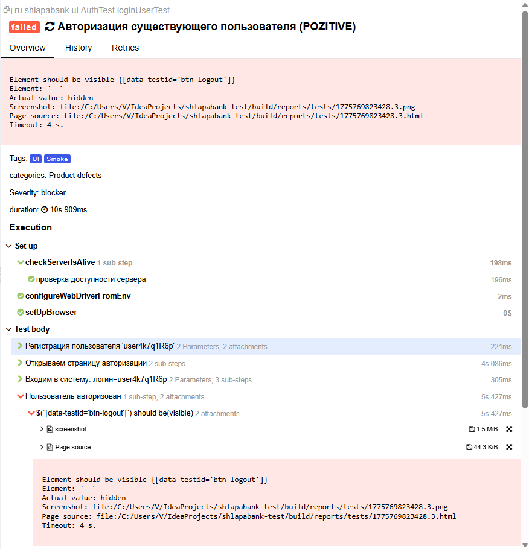
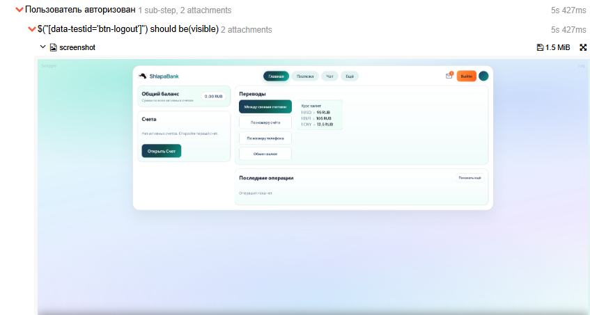

# Автотесты для тренировочного приложения ShlapaBank

Репозиторий автотестов для учебного банковского приложения **ShlapaBank**. Основной упор на **happy path** — позитивные сценарии (регистрация, счета, переводы, платежи, профиль и т.д.).

**Репозиторий приложения (бэкенд / фронт):** [вставь ссылку на GitHub или GitLab](https://github.com/)

---

## Что включает в себя проект

- **API-тесты** — REST Assured, Jackson, при необходимости JSON Schema, модели запросов и ответов.
- **UI-тесты** — Selenide, Page Object, JUnit 5; локальный браузер или удалённый (например Selenoid).
- **Отчётность** — Allure: шаги сценариев, вложения HTTP для API, скриншоты и шаги для UI.
- **Данные** — JavaFaker.
- **Окружение** — Owner, файлы `local.properties` / `web.properties`, переключение: `-Denv=...`.

### Стек

Java · Gradle · JUnit 5 · REST Assured · Jackson · Selenide · Allure · AssertJ · Lombok · JavaFaker

---

## Как устроен типичный API-тест

1. **Подготовка** — проверка доступности сервера (`GET /health`), регистрация пользователя, получение токена, при необходимости открытие счетов и подготовка сумм.
2. **Выполнение** — основной сценарий (перевод, платёж, история и т.д.) и проверки ответа.
3. **Очистка** — удаление созданных сущностей, чтобы не засорять стенд.
4. **Контроль удаления** — проверка, что удаление прошло успешно (ожидаемый ответ API).

В Allure цепочка видна по `@Step`: подготовка, тело теста, финальные шаги.

---

## Как устроен типичный UI-тест

1. **База** — проверка доступности API (`/health`), настройка браузера из properties, логирование шагов Selenide в Allure.
2. **Сессия** — для сценариев под пользователем: один раз создание пользователя через API (`@BeforeAll`), перед каждым тестом вход через UI; после класса тестов — удаление пользователя админом (`@AfterAll`).
3. **Сценарий** — Page Object, действия на страницах, проверки интерфейса.
4. **Завершение** — вложения в Allure (скриншот и др.), закрытие браузера.

---

## Запуск

Нужны **Java** и доступное приложение (URL в `config.properties` и профилях для UI).

```bash
./gradlew test              # все тесты
./gradlew api               # только API (тег JUnit: API)
./gradlew web               # только UI (тег: ui)
./gradlew test -Denv=web    # профиль Owner, например web
```

---

## Отчётность (Allure)

Результаты прогона: **`build/allure-results`**.

```bash
./gradlew allureReport
# отчёт: build/reports/allure-report/index.html

./gradlew allureServe
```

В отчёте: иерархия сценариев (`@Epic` / `@Feature` / `@Story`, `@Step`). Ниже — сначала **общий вид прогона**, затем отдельно **API** (HTTP) и **UI** (браузер).

### Общий вид прогона

Дашборд: сколько тестов прошло / упало, разбивка по suites, API и UI, категории, исполнитель (Gradle).


Краткий обзор прогона (пример с полностью зелёным прогоном):


### API-тесты в отчёте

Для REST-вызовов в шагах доступны вложения **Request** и **Response** (HTML-шаблоны FreeMarker `request.ftl` / `response.ftl`). В дереве suites видна группировка сценариев; в карточке справа — шаги и вложения к ним (для UI — скриншот и page source; для API — см. примеры ниже).


**Пример запроса (API)**


**Пример ответа (API)**


### UI-тесты в отчёте

Для UI в отчёте видны шаги Selenide, скриншоты. При падении — **сообщение проверки** (ожидание vs факт), **скриншот** страницы, **page source**, тайминги шагов.





---

Новые скрины клади в **`src/main/resources/images/`**. В Markdown: ``.

**Не отображаются картинки?**

- **В Cursor / VS Code:** открой превью README (`Ctrl+Shift+V` или иконка предпросмотра). Корень воркспейса должен быть папка проекта, где лежат `README.md` и `src/` (а не родительская директория).
- **На GitHub:** картинки появятся только если файлы **закоммичены**. Если папка с PNG и README не в git, выполни `git add README.md src/main/resources/images/` и `git push`.

---

## Структура репозитория

```
src/main/resources/images/   — картинки для README (и при необходимости для проекта)
src/main/java/ru/shlapabank/   — конфиг, шаги API, модели, Page Object
src/test/java/ru/shlapabank/   — API- и UI-тесты, базовые классы
src/test/resources/          — properties, шаблоны Allure для REST
```

---

## Заметки

Перед публикацией на GitHub убери из `*.properties` реальные URL, логины и пароли — используй плейсхолдеры или переменные окружения.
